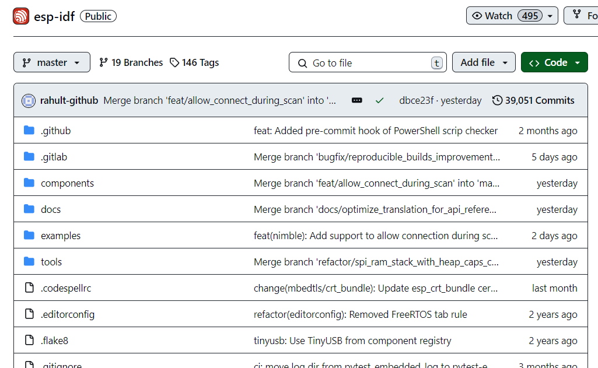

# การทดลองที่ 9 การใช้งาน ADC บน ESP32

## 9.1 แนะนำแหล่งค้นคว้า

ในกรณีที่นักศึกษาเขียนโปรแกรม ESP32 ด้วย VSCODE และ IDF  สามารถเข้าไปศึกษาตัวอย่าง source code ได้จาก repoditory ของ esp-idf ได้จาก GitHub คามลิงค์นี้ [esp-idf repository](https://github.com/espressif/esp-idf)

ให้คลิกเข้าไปที่โฟลเดอร์ examples/peripherals/adc หรือตามลิงค์นี้  [examples/peripherals/adc](https://github.com/espressif/esp-idf/tree/master/examples/peripherals/adc) 

ซึ่งจะมีสองตัวอย่าง คือ [oneshot_read](https://github.com/espressif/esp-idf/tree/master/examples/peripherals/adc/oneshot_read)  และ [continuous_read](https://github.com/espressif/esp-idf/tree/master/examples/peripherals/adc/continuous_read)

อย่างไรก็ตามเมื่อเข้าไปดู code ภายใต้โฟลเดอร์ main ของแต่ละตัวอย่างจะพบว่ามี source code ค่อนข้างมากพอสมควร เนื่องจากผู้พัฒนาต้องการให้ใช้ได้กับ ESP32 ทุกรุ่น ดังนั้นในการทดลองนี้ ต้องดึงเอาเฉพาะบางส่วนที่จำเป็น เพื่อให้สามารถทำความเข้าใจได้ง่ายขึ้น

โดยจะทำการทดลองใน 2 รูปแบบคือ  

1. oneshot_read

2. continuous_read