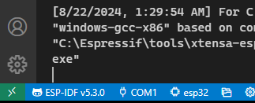
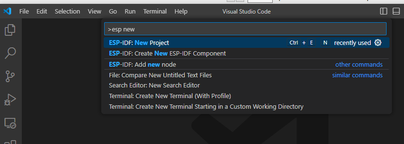
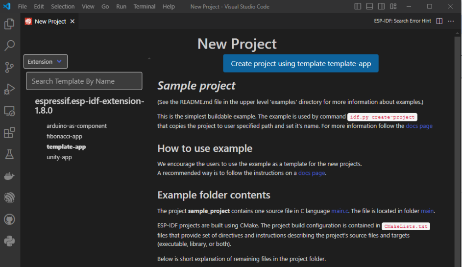

# การทดลองย่อยที่ 9.1 การใช้งาน ADC บน ESP32 ในโหมด oneshot_read

## 9.1.1 สร้าง project ใหม่ ชื่อ ESP32-Oneshot-read

###  หมายเหตุ
การทดลองนี้ ใช้ ESP-IDF v5.3.0



1. ไปที่เมนู View->Command pallete (หรือโดยการกด Ctrl+Shift+P  ใน vscode)

2. พิมพ์ `esp new` ในช่อง [ > ________]




3. กด Enter

4. ตั้งชื่อโปรเจคเป็น `ESP32-Oneshot-read` และเลือกที่ตั้งที่เหมาะสม (ชื่อโฟลเดอร์เป็นภาษาอังกฤษ ไม่ควรมีอักระพิเศษใดๆ ยกเว้น _ หรือ -)


5. เลือก template-app


6. คลิก `Create project using template tempate-app` เพื่อสร้างโปรเจคตามรายละเอียดที่กำหนดข้างต้น




7. เข้าไปยังไฟล์ `main/main.c` เริ่มแก้ไข code ตามตัวอย่างในไฟล์  [oneshot_read_main.c](https://github.com/espressif/esp-idf/blob/master/examples/peripherals/adc/oneshot_read/main/oneshot_read_main.c)

  
## 9.1.2 แก้ไขไฟล์ `main/main.c`

1. เพิ่ม code สำหรับเริ่มต้น ADC1 ใน `app_main()`

```c
    //-------------ADC1 Init---------------//
    adc_oneshot_unit_handle_t adc1_handle;
    adc_oneshot_unit_init_cfg_t init_config1 = {
    .unit_id = ADC_UNIT_1,
    };
```    

ทดลอง build โปรเจค จะพบว่ามี error ในลักษณะดังรูปด้านล่างนี้ เนื่องจากยังไม่ได้ประกาศ prototype ของ API ไว้


2. เพิ่มรายการ include ดังต่อไปนี้

```c
#include "esp_adc/adc_oneshot.h"
#include "esp_adc/adc_cali.h"
#include "esp_adc/adc_cali_scheme.h"
```

จะได้ main.c เป็นดังรูป


เมื่อทดลอง build จะสามารถ  build ได้สำเร็จ

### อธิบาย code

บรรทัดที่ 10

```c
adc_oneshot_unit_handle_t adc1_handle;
```
เป็นการสร้างตัวแปร `adc1_handle` ซึ่งมีลักษณะเป็นโครงสร้าง (struct) ที่มีตัวแปรอยู่ภายในดังนี้

```c
typedef struct adc_oneshot_unit_ctx_t {
    adc_oneshot_hal_ctx_t hal;
    uint32_t unit_id;
    adc_ulp_mode_t ulp_mode;
} adc_oneshot_unit_ctx_t;
```

|ตัวแปร | ชนิด | รายละเอียด |
|-----| ------| ------- |
|hal |adc_oneshot_hal_ctx_t| ใช้เพื่อเข้าถึง adc hardware ในระดับ HAL (ศึกษาเพิ่มเติมที่ [adc_oneshot_hal](https://github.com/espressif/esp-idf/blob/dbce23f8a449eb436b0b574726fe6ce9a6df67cc/components/hal/include/hal/adc_oneshot_hal.h#L38))|
|unit_id|uint32_t| adc unit 1 หรือ 2 |
|ulp_mode|adc_ulp_mode_t|  การควบคุมให้ ADC ทำงานในโหมดประหยัดพลังงาน (ศึกษาเพิ่มเติม [Ultra Low Power Mode](https://docs.espressif.com/projects/esp-idf/en/stable/esp32/api-reference/system/ulp.html#))|

โดยตัวแปร `adc1_handle` ที่สร้างขึ้นที่จุดนี้ จะถูกใช้เพื่อเข้าถึงและควบคุม hardware ได้ตลอดทั้งโปรแกรม


บรรทัดที่ 11-13

```c
adc_oneshot_unit_init_cfg_t init_config1 = {
    .unit_id = ADC_UNIT_1,
};
```

เลือก ADC unit ที่ 1 (ADC1)

3. เพิ่ม code สำหรับกำหนดให้ ADC1 ทำงานในโหมด oneshot 


```c
ESP_ERROR_CHECK(adc_oneshot_new_unit(&init_config1, &adc1_handle));
```

4. กำหนด config สำหรับ ADC1 โดยให้ค่า atten เป็น   ADC_ATTEN_DB_12 และจำนวนบิตเป็นค่าเริ่มต้น 

 4.1 ก่อน app_main() ให้ประกาศ

```c
#define EXAMPLE_ADC_ATTEN           ADC_ATTEN_DB_12
```

4.2 ใน app_main() เพิ่ม code

```c
//-------------ADC1 Config---------------//
adc_oneshot_chan_cfg_t config = {
    .atten = EXAMPLE_ADC_ATTEN,
    .bitwidth = ADC_BITWIDTH_DEFAULT,
};
```    

5. กำหนด config สำหรับ ADC1 channel0   

```c
ESP_ERROR_CHECK(adc_oneshot_config_channel(adc1_handle, EXAMPLE_ADC1_CHAN0, &config));
```

6. ทำการปรับเทียบ (Calibrate) ให้กับ ADC1 Channel0

```c
   //-------------ADC1 Calibration Init---------------//
    adc_cali_handle_t adc1_cali_chan0_handle = NULL;
    bool do_calibration1_chan0 = example_adc_calibration_init(ADC_UNIT_1, ADC_CHANNEL_0, EXAMPLE_ADC_ATTEN, &adc1_cali_chan0_handle);
```


7. เพิ่มตัวแปรสำหรับเก็บค่าที่ได้จากการแปลง ADC

```c
int adc_raw[2][10];
```