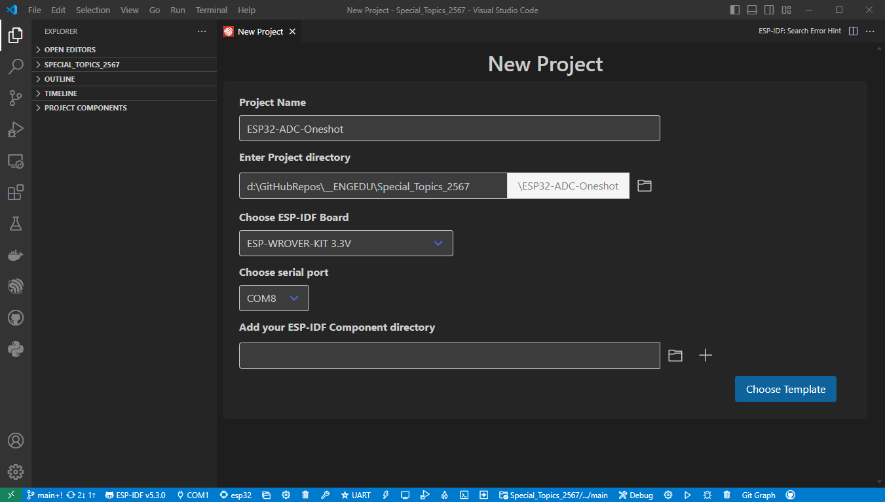
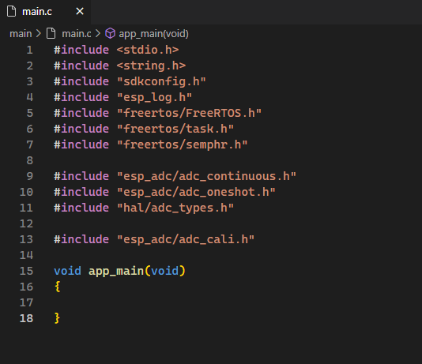
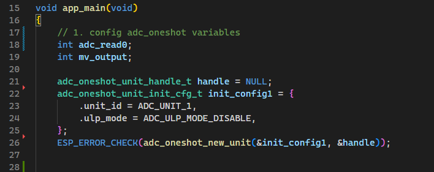
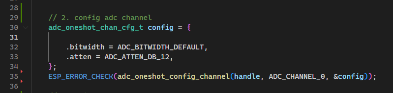
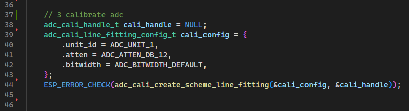

# การทดลองย่อยที่ 9.3 การใช้งาน ADC บน ESP32 ในโหมด oneshot_read ฉบับเขียน code เอง

1. สร้าง  project ใหม่



2. คลิก Choose Template


3. เลือก Template-app

4. เพิ่มเติมส่วน include




5. กำหนดค่าตัวแปร oneshot



6. กำหนด ADC channel ที่จะใช้

 

7. calibrate ADC



8. While loop


9. เชื่อมต่อสาย jumper จาก volume ไปยังขา  GPI36  ของ ESP32  เนื่องจากได้กำหนดไว้ใรโปรแกรม (บรรทัดที่  35)   

10. รันโปรแกรม หมุนวอลลุ่มและสังเกตุผลการทำงานของโปรแกรม

    ซ้ายสุด
    


    กลางๆ
    


    ขวาสุด
    


## Challenge
1. เปลี่ยนสาย jumper ไปยัง GPIO33 และแก้โปรแกรมให้สามารถรับรู้การหมุน volume ได้


2. เปลี่ยนสาย jumper ไปยัง GPIO32 และแก้โปรแกรมให้สามารถรับรู้การหมุน volume ได้

```
#include <stdio.h>
#include <string.h>
#include "sdkconfig.h"
#include "esp_log.h"
#include "freertos/FreeRTOS.h"
#include "freertos/task.h"
#include "freertos/semphr.h"

#include "esp_adc/adc_continuous.h"
#include "esp_adc/adc_oneshot.h"
#include "hal/adc_types.h"
#include "esp_adc/adc_cali.h"

void app_main(void)
{
    int adc_read0;
    int mv_output;
    adc_oneshot_unit_handle_t handle = NULL;
    adc_oneshot_unit_init_cfg_t init_config1 = {
        .unit_id = ADC_UNIT_1,
        .ulp_mode = ADC_ULP_MODE_DISABLE,
    };
    ESP_ERROR_CHECK(adc_oneshot_new_unit(&init_config1, &handle));

    adc_oneshot_chan_cfg_t config = {
        .bitwidth = ADC_BITWIDTH_DEFAULT, 
        .atten = ADC_ATTEN_DB_12,
    };
    ESP_ERROR_CHECK(adc_oneshot_config_channel (handle, ADC_CHANNEL_4, &config));

    adc_cali_handle_t cali_handle = NULL;
    adc_cali_line_fitting_config_t cali_config = {
        .unit_id = ADC_UNIT_1,
        .atten = ADC_ATTEN_DB_12,
        .bitwidth = ADC_BITWIDTH_DEFAULT,
    };
    ESP_ERROR_CHECK(adc_cali_create_scheme_line_fitting(&cali_config, &cali_handle));

    while (1)
    {
        ESP_ERROR_CHECK(adc_oneshot_read(handle, ADC_CHANNEL_4, &adc_read0));
        printf("Adc channel-0 raw read result %d \n", adc_read0);
        printf("\n\n");
        adc_cali_raw_to_voltage(cali_handle, adc_read0, &mv_output);
        printf("ADC milivolt output %d \n", mv_output);
        vTaskDelay(500/portTICK_PERIOD_MS);
    }   
}
```


ขวาสุด


กลางๆ


ซ้ายสุด

