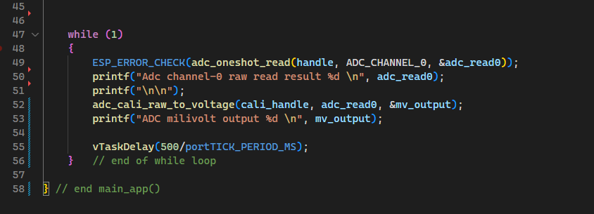

# การทดลองย่อยที่ 9.3 การใช้งาน ADC บน ESP32 ในโหมด oneshot_read ฉบับเขียน code เอง

1. สร้าง  project ใหม่

2. คลิก Choose Template

3. เลือก Template-app

4. เพิ่มเติมส่วน include

5. กำหนดค่าตัวแปร oneshot

6. กำหนด ADC channel ที่จะใช้

 

7. calibrate ADC

8. While loop

9. เชื่อมต่อสาย jumper จาก volume ไปยังขา  GPI36  ของ ESP32  เนื่องจากได้กำหนดไว้ใรโปรแกรม (บรรทัดที่  35)   

10. รันโปรแกรม หมุนวอลลุ่มและสังเกตุผลการทำงานของโปรแกรม

## Challenge
1. เปลี่ยนสาย jumper ไปยัง GPIO33 และแก้โปรแกรมให้สามารถรับรู้การหมุน volume ได้

2. เปลี่ยนสาย jumper ไปยัง GPIO32 และแก้โปรแกรมให้สามารถรับรู้การหมุน volume ได้

